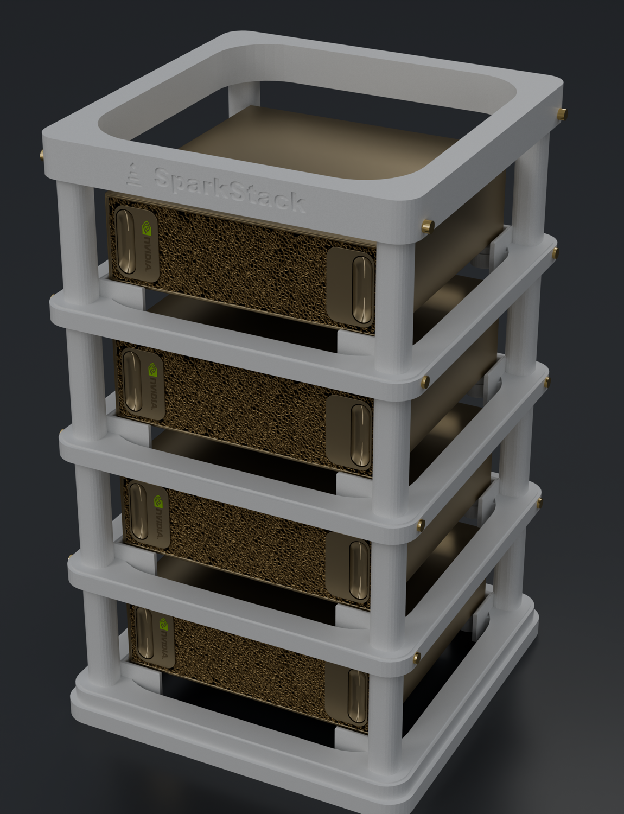
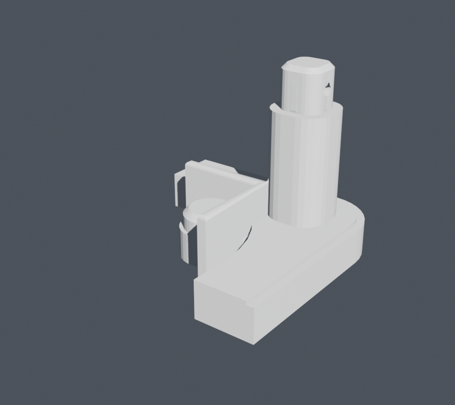
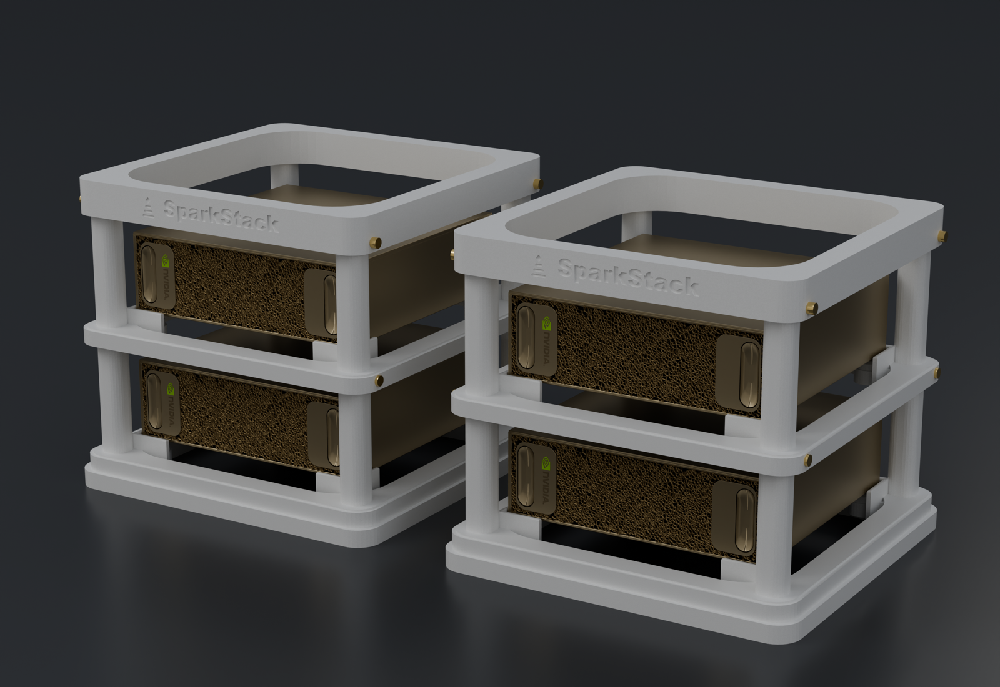
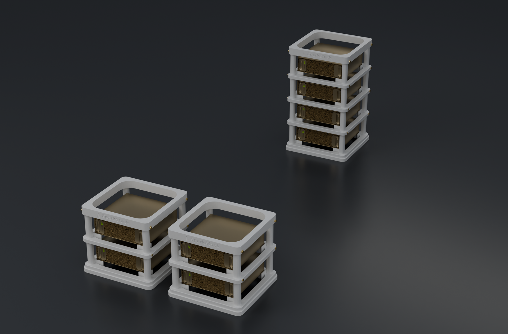
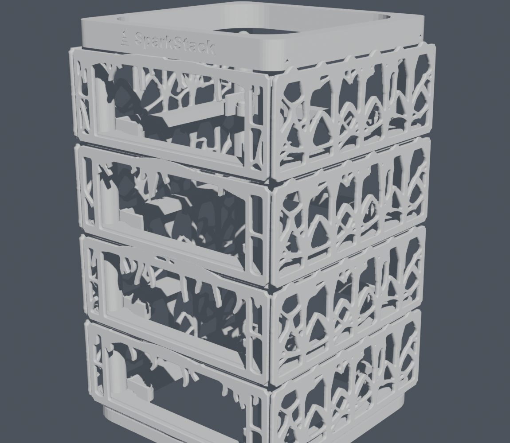
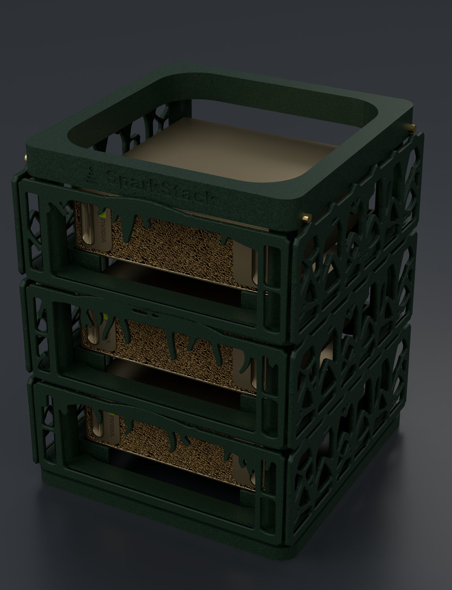
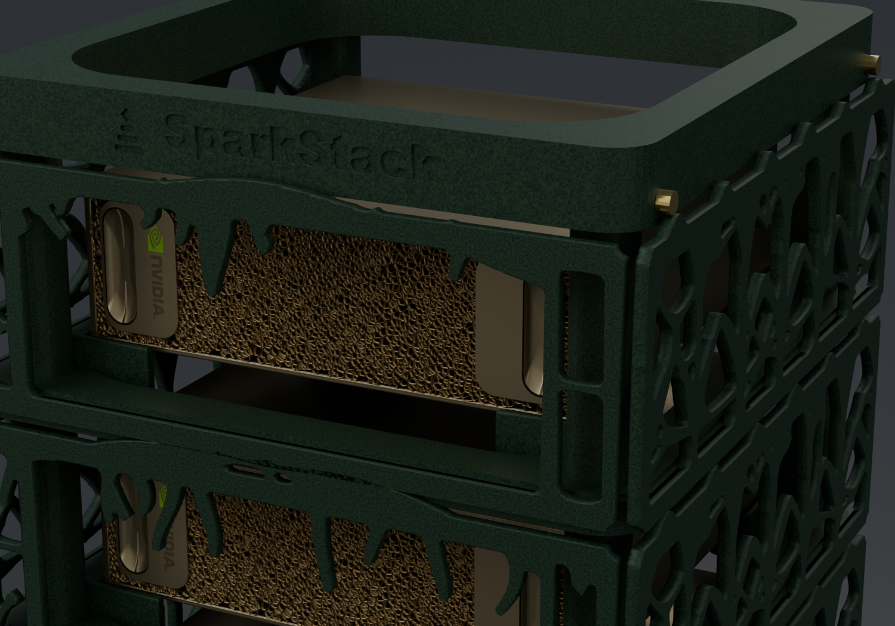

# SparkStack

A stackable, modular, 3D-printable rack for the NVIDIA DGX Spark. One to four
machines in a 205 mm footprint.



Printed in ABS or ASA. Every part fits a 220 × 220 mm bed.

**Not affiliated with, endorsed by, or sponsored by NVIDIA.** "DGX" and "Spark"
are trademarks of NVIDIA Corporation. This is an independent accessory.

## What's here

| | |
|---|---|
| `stl/` | Ready-to-slice STLs for v3.0 |
| `sparkstack.py` | Structure generator — base, tiers, cap |
| `sparkstack_panels.py` | Decorative panel generator |
| `render_sparkstack.py` | Renders: white rack, real Sparks, gold pins |
| `render_hive.py` | Renders: dark organic finish, panels on |
| `render.sh` | Blender wrapper (see *Renders*) |
| `validate_stl.py` | Checks exports are closed, watertight, single-shell |
| `profiles/` | OrcaSlicer profiles for ASA on a FlashForge AD5M Pro |

## Print set

| File | Qty |
|---|---|
| `sparkstack_v3_0_base.stl` | 1 |
| `sparkstack_v3_0_tier.stl` | 1 per machine |
| `sparkstack_v3_0_cap.stl` | 1 |

**Three parts.** A four-machine stack is one base, four tiers, one cap.

The **decorative panels are not in this release.** The generator is here and the
renders below show them fitted, but the panel STLs are not published yet — see
*Panels* for how they work and why they need a little more time.

## Model

1 unit = 1 mm. Everything is generated, not hand-modelled:

```bash
blender --background --python sparkstack.py    # writes stl/ and a spec sheet
```

Key parameters live in the `P` dict at the top of `sparkstack.py`:

| | | |
|---|---|---|
| `PITCH` | 76 mm | tier spacing; sets the air gap above each machine |
| `DEV_W` / `DEV_D` / `DEV_H` | 150 / 150 / 51.2 | the machine |
| `SIDE_CLEAR` | 1.5 mm | post clearance |
| `JOINT_CLR` | 0.15 mm | bore clearance; the ribs interfere by 0.10 mm/side |
| `RAIL_PROUD` | 2.0 mm | panel rail standoff |
| `CRADLE_CLR` | 1.0 mm | corner cradle clearance, sized for ASA shrinkage |
| `BASE_R` | 14 mm | base corner radius |

## The constraint that shapes everything

The machine draws air in through its **front face** (upper and lower) and its
**underside**, both dust-filtered, and exhausts out the **rear** heatsink fins
and the QSFP fin stack.
([ChargerLAB teardown](https://www.chargerlab.com/teardown-of-nvidia-dgx-spark-4tb/))

So there is no shelf under it. The tier ring opens to **168 × 168 mm**, wider
than the machine's own 150 mm silhouette, leaving a 9 mm annulus around the
chassis. The machine rests on **four Ø14 mm pads** at (±68, ±68) mm, shadowing
**3.5% of the underside**, all at the corners.

That is also why the panels are **open webbing rather than solid skins** — a
closed front panel would strangle the intake.

`PITCH` sets the air gap above each machine: at 76 mm it is **11.8 mm**. For
scale, buoyancy across a full four-tier stack is ~0.26 Pa against tens of Pa
from the machine's own blowers, and the intake annulus costs ~0.13–0.25 Pa at a
plausible 10–20 CFM. The rack's contribution to the intake path is small, and
the gap above the machine is not in that path at all: the top of the chassis is
neither intake nor exhaust.

**None of this has been measured on hardware.** It is analysis plus published
specs. Treat it as a starting point, not a guarantee.

## Panels

**Not shipped yet.** The renders at the top of this README show them fitted;
the STLs are not in this release. Everything below describes the design as
built, so the generator in `sparkstack_panels.py` and the geometry it produces
match what you see — but treat the panel files as unreleased until they appear
in `stl/`.

Each tier's front comes from its own seed, so a stack doesn't read as four
copies of one part. The sides are identical across tiers.

The panels are flat 4 mm plates with a hook along the bottom of the inner face
that drops over a rail on the tier. Printed flat, the panel's inner face is up,
so the hook is a step in the top surface — there is no overhang anywhere, which
matters because ABS and ASA with near-zero part cooling will string and stay
uncured on any unsupported ceiling.

An earlier attempt put the locating groove in the tier's vertical wall instead.
That groove's ceiling was a flat bridge and it printed badly. Hence the rail.

## Corner cradles

Each pad is backed by a square L-shaped wall, 2.5 mm thick, rising 6 mm above
the seat. It stops the machine sliding in either axis. The plan is square on
purpose — it matches the footprint it fits — with a 1 mm round-over on the top
edge only, so no 90° edge shows in the front view. No snap lip: it was a 0.6 mm
ledge hanging over open air, exactly the overhang that strings in ASA.

`CRADLE_CLR` is 1.0 mm rather than a tight 0.25 mm because ASA shrinks ~0.6%:
over a 150 mm opening that is 0.45 mm per side, so a 0.25 mm gap would print as
an interference fit.

## The joint

Tiers join on four corner tenons into four sockets. The fit is meant to hold a
stack up on its own — the pins are insurance, not structure.

Bore **11.30 mm**, ribbed tenon **11.50 mm**: 0.10 mm of interference per side
across four crush ribs over a 7 mm band. Both halves are the same material, so
shrinkage moves them together and the fit is unchanged after printing.

**Check the fit before you commit to a full tier.** `sparkstack.py` can generate
a one-corner coupon — a half-height column carrying both halves of the joint —
which is far cheaper to print than a tier. Print two and stack them.



If it comes out wrong, `JOINT_CLR` and `RIB` are the two numbers to move.

Gold pins through each joint are optional. The holes are Ø3.4 mm and take an M3
screw or a printed pin.

## Renders

| | |
|---|---|
|  |  |
| Four high | Two stacks of two |
|  |  |
| Both configurations | Single tier, showing the rail and cradles |
|  |  |
| Dark organic finish, **panels fitted — not shipped** | Closer: webbing, drips, wordmark, pins |

`render_sparkstack.py` and `render_hive.py` drive Cycles from a script — no
HDRI, no image textures, no manual scene setup. Use the wrapper:

```bash
./render.sh --background --python render_hive.py
```

The wrapper exists because Cycles compiles its Metal kernels on the first GPU
render of a session and caches them under `$HOME/Library/Caches`. Under a
sandboxed or read-only home that path is unwritable, the compile repeats on
every launch, and you pay 150–200 s per run instead of ~10 s. `render.sh` points
`HOME` at a local directory so the cache persists. Harmless outside a sandbox.

On an M2 Max at 1150 × 1500, 32 samples:

| | |
|---|---|
| CPU | 31.7 s per frame |
| GPU, first of a session | 152–208 s (kernel compile) |
| GPU, warm | **3.2 s per frame** |

`cycles.preferences.devices` is **lazily enumerated** — it stays empty until you
call `get_devices()`, so setting `cycles.device = 'GPU'` on its own enables
nothing and Cycles falls back to CPU without raising. Both scripts do it
properly; if you copy the setup, don't drop that call.

**The Spark model is not included.** It is a third-party asset and not ours to
redistribute. The render scripts will tell you where to download it (free, no
signup); the rack itself needs none of it. Those renders are visualisations
against an unofficial model, not NVIDIA CAD — don't take connector clearances
off them.

## Printing

ABS or ASA. Enforced, not a preference: the design leans on those materials'
stiffness and temperature resistance, and the profiles here are for ASA.

- Bed contact ranges 4,163–13,820 mm² across the parts
- Overhang ≤ 2.1% on every part; there are no intentional unsupported spans
- Print the panels flat — thickness is the build direction, and local z = 0 is
  the outer face (bed side)
- Every exported STL is verified closed, watertight, and **single-shell**;
  `python3 validate_stl.py stl/*.stl` re-checks it

## License

**CC BY-NC-SA 4.0** — see `LICENSE`.

You may download, modify, and print these files for personal use, and share your
modifications under the same license. You may **not** sell prints, sell the
files, or ship them inside a commercial product.

**Commercial licensing is available.** If you want to sell printed units or a
kit, get in touch — that's a conversation, not a no.
